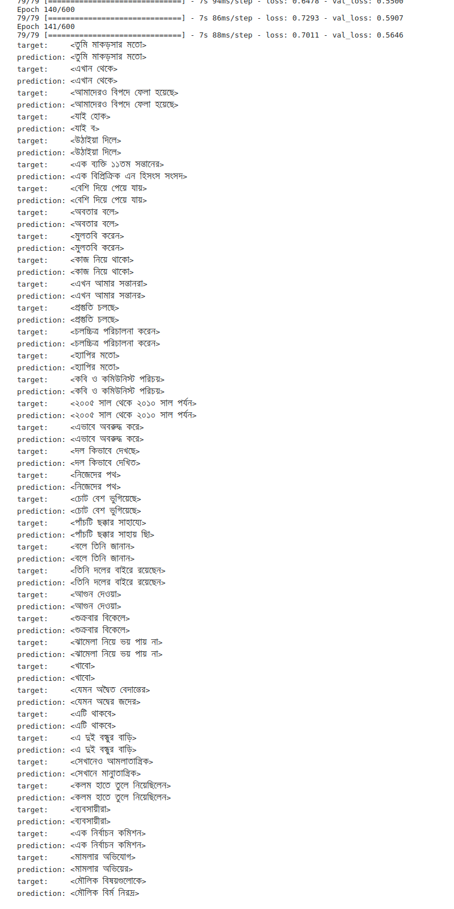

# BanglaASR
`BanglaASR` is a [Transformer](https://en.wikipedia.org/wiki/Transformer_(machine_learning_model)) based Bangla [Automatic Speech Recognition (ASR)](https://en.wikipedia.org/wiki/Speech_recognition) System. I try to create a overfited model (intentionally) to build a proof of concept that, `Transformer` based model could be use for `Bangla ASR`. The intention of this project is to build up an end to end Bangla ASR pipeline so that, the people who are working on Bangla Speech Recognition, could use this as a starting point.

__Quick demo:__ [Video link](https://www.youtube.com/watch?v=s9nGrG5cF5M&list=PL4wQs28gofOGVZfH0jG0U7dMB-fzA69ph)

## Dataset
[Bengali ASR training dataset](http://openslr.org/53/) containing `~196K utterances`. I did not training with all the sample instead I take a portion of sample from this dataset. You will find the samall dataset under `data/`

## Dependency
```bash
sudo apt install sox # use for converting flac to wav

pip install tensorflow=2.4
pip install pandas
```

## Project structure
```bash
BangalASR/
├── bnasr
│   ├── config.py     # config variable
│   ├── dataset.py    # process and clean-up data
│   ├── __init__.py   # module init script
│   ├── model.py      # transformer netwrok
│   ├── train.py      # training script
│   └── utils.py      # contrain utility methods
├── data              # contain all training and test data
│   ├── asr-bengali-1000
│   │   ├── asr_bangal_1000.csv
│   │   └── asr_bengali_1000_wav.zip
│   ├── asr-bengali-200
│   │   ├── asr_bangal_200.csv
│   │   └── asr_bengali_200.zip
│   └── test-samples  # test sample data
│       ├── test_data.csv
│       └── test_wav
├── db
│   └── chars_75.csv  # unique character set
├── LICENSE
├── models            # pre-train model
│   ├── bnasr-550-0.5448.data-00000-of-00001
│   ├── bnasr-550-0.5448.index
│   └── checkpoint
├── notebooks         # inferance notebook script
│   └── asr_inferance.ipynb
├── README.md
└── tests             # test scripts
    └── test_dataset.py
```

## Inferance
For inferance please check [Inferance script](./notebooks/asr_inferance.ipynb)

```python
import pandas as pd

from bnasr import utils
from bnasr.utils import VectorizeChar
from bnasr.model import Transformer


# max sequence to predict
max_target_len = 30
# init vectorizer
vectorizer = VectorizeChar(unique_chars, max_len=max_target_len)
vocab_size = len(vectorizer.get_vocabulary())

print(f"Vocab size: {vocab_size}")

# init transformer asr model
model = Transformer(
    num_hid=128,
    num_head=2,
    num_feed_forward=256,
    target_maxlen=max_target_len,
    num_layers_enc=2,
    num_layers_dec=1,
    num_classes= 77
)

# set checkpoint path
model_checkpoint = '../models'
# load checkpoint
latest = tf.train.latest_checkpoint(model_checkpoint)
model.load_weights(latest)

def predict(source, target_start_token_idx, target_maxlen):
    """Performs inference over one batch of inputs using greedy decoding."""
    bs = tf.shape(source)[0]
    enc = model.encoder(source)
    dec_input = tf.ones((bs, 1), dtype=tf.int32) * target_start_token_idx
    dec_logits = []
    for i in range(target_maxlen-1):
        dec_out = model.decode(enc, dec_input)
        logits = model.classifier(dec_out)
        logits = tf.argmax(logits, axis=-1, output_type=tf.int32)
        last_logit = tf.expand_dims(logits[:, -1], axis=-1)
        dec_logits.append(last_logit)
        dec_input = tf.concat([dec_input, last_logit], axis=-1)
    return dec_input

target_start_token_idx=2
target_end_token_idx = 3
idx_to_char = vectorizer.get_vocabulary()


# load test audio sample
test_data = '../data/test-samples/test_data.csv'
df = pd.read_csv(test_data)

for i, d in df.iterrows():
    # take audio and it's actual text
    audio, text = os.path.join(wav_dir, d['audio']), d['text']
    print(f"Sample [ {i+1} ] target text: {text}")
    print(f"Target audio: {audio}")
    ipd.display(ipd.Audio(audio))

    target_audio = utils.path_to_audio(audio)
    target_audio = tf.expand_dims(target_audio, 0)
    # perform prediction on given target audio file
    preds = predict(target_audio, target_start_token_idx, target_maxlen=max_target_len)

    preds = preds.numpy()[0]
    prediction = []
    for idx in preds:
        prediction.append(idx_to_char[idx])
        if idx == target_end_token_idx:
            break

    prediction = ''.join(prediction)
    print(f"prediction: {prediction}")
    print('-'*50)

## sample output on test samples
Sample [ 1 ] target text: তেঁতুলিয়ার ভজনপুর গ্রামের
Target audio: ../data/test-samples/test_wav/070078fb60.wav
prediction: <তেঁতুলিয়ার ভজনপুর গ্রামের>
--------------------------------------------------
Sample [ 2 ] target text: জবাবদিহিতায় আনার জন্য
Target audio: ../data/test-samples/test_wav/070091fd89.wav
prediction: <জবাবদিহিতায় আনার জন্য>
--------------------------------------------------
Sample [ 3 ] target text: বিষয়টি পুলিশকে জানানো হয়
Target audio: ../data/test-samples/test_wav/070a2946a9.wav
prediction: <বিষয়টি পুলিশকে জানানো হয়>
--------------------------------------------------
Sample [ 4 ] target text: ১৯৮৭ সালের ২০ ফেব্রুয়ারি
Target audio: ../data/test-samples/test_wav/071d32bd73.wav
prediction: <১৯৮৭ সালের ২০ ফেব্রুয়ারি>
--------------------------------------------------
Sample [ 5 ] target text: অফিস সুটের সর্বশেষ ভার্সনটি
Target audio: ../data/test-samples/test_wav/072f9bb48f.wav
prediction: <অফিস সুটের সর্বশেষ ভার্সনটি>
--------------------------------------------------
Sample [ 6 ] target text: ১০ গোলে পরাজিত করে
Target audio: ../data/test-samples/test_wav/073598e69d.wav
prediction: <১০ গোলে পরাজিত করে>
--------------------------------------------------
Sample [ 7 ] target text: সবচেয়ে দরিদ্র এলাকাগুলোর একটি
Target audio: ../data/test-samples/test_wav/0750033e3e.wav
prediction: <সবচেয়ে দরিদ্র এলাকাগুলোর এক>
--------------------------------------------------
Sample [ 8 ] target text: আকাশের দিকেই ছুঁড়তে থাকে
Target audio: ../data/test-samples/test_wav/0772cc6e7c.wav
prediction: <আকাশের দিকেই ছুঁড়তে থাকে>
--------------------------------------------------
Sample [ 9 ] target text: চাঁদনী রাতের ভালোবাসার ফটো
Target audio: ../data/test-samples/test_wav/07738a801d.wav
prediction: <চাঁদনী রাতের ভালোবাসার ফটো>
--------------------------------------------------
```

## Training

If you want to regenerate the training you can use [this kaggle notebook](https://www.kaggle.com/code/menonbrur/bangla-asr-transformer)
After epoch 140 you should get output like this. This training is done on very small amount (~ 5 hr) of data and validation is done on the 1% data taken from the training dataset



## Citation
```
@misc{BanglaASR,
  title={Bangla Transformer Based ASR},
  author={Mehadi Hasan Menon},
  howpublished={https://github.com/menon92/BangalASR},
  year={2020}
}
```

## Referance
- [The Illustrated Transformer](http://jalammar.github.io/illustrated-transformer/)
- [Attention is All You Need](https://papers.nips.cc/paper/2017/file/3f5ee243547dee91fbd053c1c4a845aa-Paper.pdf)
- [Transformer ASR](https://keras.io/examples/audio/transformer_asr/)
- [Very Deep Self-Attention Networks for End-to-End Speech Recognition](https://arxiv.org/pdf/1904.13377.pdf)
- [Speech Transformers](https://ieeexplore.ieee.org/document/8462506)
- [Bangla Speech Dataset](https://bengali.ai/datasets/)
- [Save and load TensorFlow model](https://www.tensorflow.org/tutorials/keras/save_and_load)
